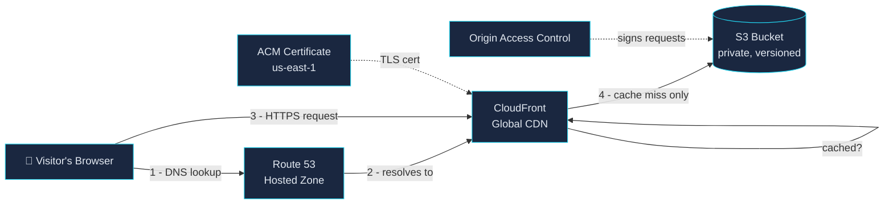

## PROJECT 1: "Hello Cloud" — Deploy a Website to AWS from Scratch

### 🧠 What Is This?

Before you can run rockets, you need to understand fuel. This project
teaches you how the internet actually works and how AWS stores and serves
files globally.

Imagine you wrote an amazing book (your website). **S3** is the warehouse
that stores it. **CloudFront** is the delivery truck network that gets it
to readers worldwide in seconds, instead of everyone having to drive to
your one warehouse. **Route 53** is the address system — like GPS — that
turns "my-site.com" into "the actual warehouse is over here." **ACM** is
the tamper-proof seal on the package that proves it's really from you and
hasn't been opened in transit (HTTPS).

By the end, you'll have a live, public website with a real domain,
encrypted traffic, and global delivery — the same building blocks Netflix,
Amazon, and basically every serious company use for static assets.

### 🗺️ Architecture Diagram



**Why cache miss matters**: the first visitor from a given AWS edge region
triggers a fetch from S3; every visitor after that (from that region, until
the cache expires) gets served straight from CloudFront's edge — S3 is
barely involved. That's the whole speed trick.

### 💰 AWS Cost Estimate

| Service | Free Tier | Beyond Free Tier |
|---|---|---|
| S3 | 5 GB storage, 20K GET/2K PUT requests/month (12 months) | ~$0.023/GB/month + $0.0004/1K requests |
| CloudFront | 1 TB data transfer out, 10M requests/month (always free, not just 12 months) | ~$0.085/GB after that |
| Route 53 | None | $0.50/month per hosted zone + $0.40/million queries |
| ACM | Always free | Always free (certs issued for AWS resources cost nothing) |

**Realistic total for a low-traffic personal site: ~$0.50–1.00/month**
(almost entirely the Route 53 hosted zone fee — everything else stays
inside free tier limits for a portfolio site). Domain *registration* itself
(if you don't already own one) is separate, typically $9–14/year through
Route 53 or any registrar.

### 🛠️ Tools & Why We Use Each One

| Tool | Problem It Solves | Alternative Without It |
|---|---|---|
| **S3** | Durable, infinitely-scalable file storage with no server to manage | You'd run and patch your own web server 24/7 |
| **CloudFront** | Serves files from a location physically near the visitor | Every visitor round-trips to one region — slow for anyone far from it |
| **Route 53** | Maps a human-readable domain to AWS resources, with health checks | You'd depend on a third-party DNS host with no AWS integration |
| **ACM** | Free, auto-renewing TLS certificates | You'd manually buy, install, and renew certs every ~90 days (Let's Encrypt) or ~1 year (paid CA) |
| **Terraform** | Infrastructure defined as code — reviewable, repeatable, destroyable in one command | Clicking through the console by hand, with no record of what you did or how to undo it |
| **IAM (non-root user)** | Scoped permissions, so a leaked credential can't nuke your whole account | Using the root user daily means one leaked key = total account compromise |

### 📋 Prerequisites

- An AWS account (free to create; a credit card is required but nothing
  in this project should exceed the free tier except the Route 53 zone fee)
- A domain name you control, OR willingness to register one through Route 53
  (~$12/year for a `.com`)
- [AWS CLI v2](https://docs.aws.amazon.com/cli/latest/userguide/getting-started-install.html) installed —
  verify with `aws --version`
- [Terraform >= 1.5](https://developer.hashicorp.com/terraform/install) installed —
  verify with `terraform -version`
- Basic command-line comfort (copy-paste commands, read error messages)

No prior AWS experience assumed.

### 🚀 Step-by-Step Build

#### Step 1 — Create a non-root IAM user (do this before anything else)

**Why does this matter?** The root user on an AWS account has unlimited
power — it can delete everything, change billing, close the account. If
its credentials leak (committed to git, phished, whatever), the damage is
total and hard to undo. A day-to-day IAM user with scoped permissions means
a leaked credential is a contained incident, not a catastrophe. AWS's own
security guidance is: **never use the root user for anything after initial
setup.**

Console steps:
1. Sign in to the AWS Console as root (only time you'll do this).
2. Go to **IAM → Users → Create user**.
3. Name it something like `terraform-deployer`.
4. Attach the policy `AdministratorAccess` for now (you'll scope this down
   in Project 2 once you know exactly which permissions you actually use —
   over-restricting on day one just means fighting permission errors
   instead of learning).
5. Under **Security credentials**, create an **access key** → choose
   "Command Line Interface (CLI)" as the use case.
6. Save the Access Key ID and Secret Access Key somewhere safe — the
   secret is shown exactly once.
7. **Enable MFA on both the root user and this IAM user** (IAM → your
   user → Security credentials → Assign MFA device). This is the single
   highest-leverage security step you can take on a cloud account.

CLI equivalent (run these as root/admin once, then never touch root again):
```bash
aws iam create-user --user-name terraform-deployer
aws iam attach-user-policy \
  --user-name terraform-deployer \
  --policy-arn arn:aws:iam::aws:policy/AdministratorAccess
aws iam create-access-key --user-name terraform-deployer
```

Configure the CLI to use this user:
```bash
aws configure
# AWS Access Key ID: <paste>
# AWS Secret Access Key: <paste>
# Default region: us-east-1
# Default output format: json
```

Verify it worked:
```bash
aws sts get-caller-identity
# Should print your account ID and the terraform-deployer ARN — NOT "root"
```

#### Step 2 — Point Terraform at your domain

If you don't already have a Route 53 hosted zone for your domain:
```bash
aws route53 create-hosted-zone \
  --name yourdomain.com \
  --caller-reference "$(date +%s)"
```
This prints a set of **NS (nameserver) records**. If you registered the
domain elsewhere (GoDaddy, Namecheap, etc.), go update that registrar's
nameserver settings to point at these four AWS nameservers — DNS won't
resolve correctly until you do. This can take a few minutes to a few hours
to propagate.

#### Step 3 — Review the Terraform

Open `terraform/main.tf`. It provisions, in order: an encrypted/versioned
private S3 bucket, a CloudFront Origin Access Control, an ACM certificate
(DNS-validated automatically), the CloudFront distribution itself, and the
Route 53 A-record pointing your domain at it.

> **Why not the classic "public S3 bucket + website hosting endpoint"
> tutorial approach?** That pattern requires your bucket to be world-
> readable and only supports HTTP between CloudFront and the origin. The
> OAC pattern here keeps the bucket fully private — CloudFront is the only
> thing on Earth that can read it — with no downside. Same result for the
> visitor, meaningfully more secure at rest.

#### Step 4 — Deploy the infrastructure

```bash
cd terraform
terraform init      # downloads the AWS provider
terraform plan -var="domain_name=yourdomain.com"   # shows what WILL be created — read it
terraform apply -var="domain_name=yourdomain.com"  # type "yes" to confirm
```

This takes 5–10 minutes — most of that is CloudFront distribution creation
and ACM DNS validation propagating.

#### Step 5 — Upload the site

```bash
cd ..
chmod +x deploy.sh
./deploy.sh
```

This reads the bucket name and distribution ID straight out of Terraform's
state (no copy-pasting IDs around), uploads `index.html` and `styles.css`,
and invalidates the CloudFront cache so the new version is live immediately.

#### Step 6 — Test global load time, with and without CloudFront

Compare hitting the S3 bucket's regional endpoint directly vs. your
CloudFront domain:
```bash
# Direct to S3 (single region — slow for anyone far from it)
curl -w "\nTime: %{time_total}s\n" -o /dev/null -s \
  "https://$(terraform -chdir=terraform output -raw bucket_name).s3.amazonaws.com/index.html"

# Through CloudFront (served from the nearest edge location)
curl -w "\nTime: %{time_total}s\n" -o /dev/null -s \
  "https://$(terraform -chdir=terraform output -raw cloudfront_domain_name)/index.html"
```
Run each a few times — the CloudFront request gets dramatically faster
after the first hit (that's the cache warming up), while the direct-to-S3
request stays roughly constant since it always makes the full trip.

#### Step 7 — Demonstrate rollback with S3 versioning

Break the site on purpose, then undo it:
```bash
# 1. Make a "bad" deploy
echo "<h1>Oops, broken deploy</h1>" > index.html
./deploy.sh

# 2. Confirm it's broken
curl -s "https://yourdomain.com" | grep "Oops"

# 3. List the version history
aws s3api list-object-versions \
  --bucket "$(terraform -chdir=terraform output -raw bucket_name)" \
  --prefix index.html \
  --query "Versions[*].[VersionId,LastModified]" --output table

# 4. Roll back: copy the previous version back over the current one
aws s3api copy-object \
  --bucket "$(terraform -chdir=terraform output -raw bucket_name)" \
  --copy-source "$(terraform -chdir=terraform output -raw bucket_name)/index.html?versionId=<PREVIOUS_VERSION_ID>" \
  --key index.html

# 5. Invalidate cache so the fix shows immediately
aws cloudfront create-invalidation \
  --distribution-id "$(terraform -chdir=terraform output -raw cloudfront_distribution_id)" \
  --paths "/*"
```
Re-pull `git checkout -- index.html` locally too, so your working copy
matches what's actually live.

### ✅ Verification Checklist

- [ ] `aws sts get-caller-identity` shows the IAM user, not root
- [ ] MFA is enabled on both root and the IAM user
- [ ] `terraform apply` completed with no errors
- [ ] `https://yourdomain.com` loads over HTTPS with a valid padlock (no cert warning)
- [ ] `curl -I https://yourdomain.com` returns `HTTP/2 200`
- [ ] The direct-to-S3 URL returns `403 Forbidden` (proves the bucket isn't public)
- [ ] CloudFront timing test shows the edge-cached request is faster than direct-to-S3
- [ ] `aws s3api list-object-versions` shows multiple versions of `index.html` after two deploys
- [ ] The rollback steps above actually restore the previous content

### 🔥 Common Mistakes & How to Fix Them

1. **ACM certificate stuck in "Pending validation" forever.**
   Usually means the DNS validation CNAME record didn't get created, or
   you're looking at the cert in the wrong region. ACM for CloudFront
   *must* be in `us-east-1` — `terraform-deployer`'s cert here uses the
   `aws.us_east_1` provider alias specifically for this reason. Check
   **Route 53 → your hosted zone** for the validation CNAME Terraform
   should have created automatically.

2. **`403 Forbidden` on the CloudFront URL itself (not just the direct S3 URL).**
   Almost always the S3 bucket policy's `AWS:SourceArn` condition doesn't
   match the distribution ARN — happens if you edited the distribution
   after applying, or if the policy applied before the distribution
   existed. Re-run `terraform apply`; the dependency graph should handle
   ordering, but a `terraform destroy && terraform apply` clears any
   drift if it doesn't.

3. **Domain doesn't resolve at all.**
   Nameservers at your registrar don't match the ones Route 53 gave you
   for the hosted zone. Check with `dig NS yourdomain.com` and compare
   against `aws route53 get-hosted-zone --id <ZONE_ID>`.

4. **Changes uploaded to S3 don't show up on the live site.**
   CloudFront is caching the old version. `deploy.sh` invalidates `/*`
   automatically — but if you uploaded manually with `aws s3 cp` instead
   of running the script, you skipped that step. Invalidations also take
   30–60 seconds to fully propagate; don't panic-refresh immediately.

5. **`terraform apply` fails with "BucketAlreadyExists."**
   S3 bucket names are globally unique across *all* AWS accounts, not
   just yours. Someone else already has `hello-cloud` or whatever you
   picked. Set a more specific `-var="bucket_name=..."` (e.g. include
   your domain or a random suffix).

### 🔗 How This Connects to the Next Project

You now have a place code *lives* once it's built. Project 2 ("Robot
Builder") is about how it *gets there* — instead of running `./deploy.sh`
by hand every time, a GitHub Actions + CodePipeline setup will test,
build, and deploy automatically on every `git push`. The IAM user and
security habits from this project (non-root, scoped credentials, MFA)
carry forward directly — Project 2 adds a *second*, even more restricted
IAM role specifically for the pipeline itself.
