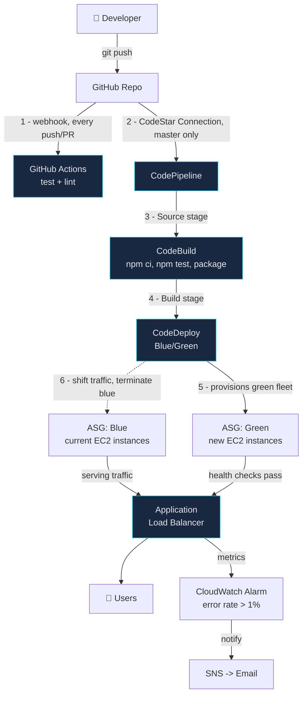

## PROJECT 2: "Robot Builder" — Full CI/CD Pipeline with GitHub Actions + AWS

### 🧠 What Is This? (Explain Like I'm 14)

You shouldn't deploy code by hand. Every manual step is a chance to forget
something, run it in the wrong order, or deploy the wrong version. CI/CD
pipelines are robots that test, build, and deploy your code automatically
every time you make a change.

Imagine a car factory. You design the car (write code), press a button,
and robots weld, paint, and ship it without you touching anything.
**GitHub Actions** is the factory floor manager — the first robot that
checks your work before it's allowed further down the line. **AWS
CodeBuild** is the robot welder — it actually assembles the build.
**AWS CodeDeploy** is the shipping department — it gets the finished
product onto the trucks (EC2 instances) without ever leaving a customer
standing at an empty counter (zero downtime).

By the end, pushing code to `master` triggers tests, a build, and a
zero-downtime deployment — with no human touching a keyboard after the
`git push`.

### 🗺️ Architecture Diagram



**Two robots, two jobs**: GitHub Actions runs on *every* push and PR,
fast, as a merge gate — it never touches AWS. CodePipeline runs only on
pushes to `master` (after code is already merged) and does the actual
AWS deployment. Redundant-looking, but each catches different failure
classes: Actions blocks bad code from merging; CodeDeploy's
`ValidateService` hook blocks bad *runtime* behavior from serving traffic,
even if the code technically passed its unit tests.

### 💰 AWS Cost Estimate

| Service | Free Tier | Beyond Free Tier |
|---|---|---|
| EC2 (t3.micro, 1-2 instances) | 750 hrs/month (12 months) | ~$7.50/month per instance |
| Application Load Balancer | None | ~$16/month + $0.008/LCU-hour |
| CodePipeline | 1 free pipeline/month | $1/month per additional active pipeline |
| CodeBuild | 100 build minutes/month (always free) | $0.005/build minute (general1.small) beyond that |
| CodeDeploy (to EC2) | Always free | Always free — you only pay for the EC2/ALB it uses |
| Secrets Manager | 30-day trial per secret | $0.40/secret/month + $0.05/10K API calls |
| CloudWatch Alarms | 10 alarms free | $0.10/alarm/month beyond that |
| SNS | 1,000 email notifications free | $2/100K notifications beyond that |

**Realistic total for this project running continuously: ~$25–30/month**
(the ALB is the dominant cost — it's a fixed hourly charge regardless of
traffic). This is the first project in the series with a real recurring
bill; **tear it down with `terraform destroy` when you're not actively
using it** if cost matters to you.

### 🛠️ Tools & Why We Use Each One

| Tool | Problem It Solves | Alternative Without It |
|---|---|---|
| **GitHub Actions** | Fast, free feedback on every push/PR — blocks bad code before it merges | Broken code reaches `master`, and everyone downstream inherits the bug |
| **CodePipeline** | Orchestrates source → build → deploy as one auditable, repeatable flow | Someone SSHes in and runs deploy steps by hand — unrepeatable, unaudited |
| **CodeBuild** | Managed, ephemeral build environment — no "works on my machine" | You maintain a dedicated build server that drifts from prod over time |
| **CodeDeploy (Blue/Green)** | New version proven healthy *before* it receives traffic; instant rollback path | In-place deploys mean a bad release is live the moment it lands — no safety net |
| **Application Load Balancer** | Distributes traffic, health-checks instances, is what CodeDeploy re-points during blue/green | One EC2 instance is a single point of failure with a deploy-time outage |
| **Auto Scaling Group** | Replaces unhealthy instances automatically, scales with load | A dead instance stays dead until a human notices |
| **Secrets Manager** | Credentials never sit in code or `.env` files that can leak into git | A leaked API key in a public repo is a matter of "when," not "if" |
| **CloudWatch Alarms** | You find out about a broken deploy from an alert, not from a customer | Problems get discovered via angry support tickets instead |

### 📋 Prerequisites

- Everything from [Project 1](../project-1-hello-cloud/) (non-root IAM user, AWS CLI, Terraform)
- [Node.js 18+](https://nodejs.org/) installed locally, for running tests before you push
- A GitHub repository this code lives in, with admin access (to authorize
  the CodeStar connection and set branch protection)
- Comfort reading a stack trace when a test fails

### 🚀 Step-by-Step Build

#### Step 1 — Understand the app

`app/app.js` is a 5-endpoint Express API for a `tasks` resource
(GET all, GET one, POST, PUT, DELETE) plus a `/health` endpoint that
CodeDeploy and the ALB both use to check the app is actually alive —
not just that the process exists, but that it can answer a request.

`tests/tasks.test.js` covers every endpoint, including the error paths
(missing task, invalid input). **Why test before deploy?** A test suite
is a promise about behavior that a machine can verify in seconds — a
human reviewing a diff cannot reliably catch "this breaks DELETE for
tasks that don't exist" just by reading code. Run them locally first:

```bash
cd project-2-robot-builder/app
npm install
npm test
```

#### Step 2 — Set up GitHub Actions + branch protection

`​.github/workflows/project-2-ci.yml` (repo root — GitHub only reads
workflows from there, not from a subfolder) runs the test suite on every
push and pull request touching this project.

Turn it into an actual gate:
1. Push this repo to GitHub if you haven't already.
2. **Settings → Branches → Add branch protection rule** for `master`.
3. Enable **"Require status checks to pass before merging"**, and select
   the `test` job from `Project 2 - Robot Builder CI`.
4. Now a PR with failing tests physically cannot be merged, no matter who approves it.

CLI equivalent (branch protection isn't a plain `gh` subcommand — it's an API call):
```bash
gh api repos/<owner>/<repo>/branches/master/protection \
  --method PUT \
  --field required_status_checks='{"strict":true,"contexts":["test"]}' \
  --field enforce_admins=true \
  --field required_pull_request_reviews=null \
  --field restrictions=null
```

#### Step 3 — Deploy the infrastructure

```bash
cd project-2-robot-builder/terraform
terraform init
terraform plan -var="github_repo=YOUR_GITHUB_USERNAME/YOUR_REPO_NAME"
terraform apply -var="github_repo=YOUR_GITHUB_USERNAME/YOUR_REPO_NAME"
```

This provisions the ALB, both blue/green target groups, the Auto Scaling
Group, CodeBuild project, CodeDeploy app, and CodePipeline — but the
pipeline can't pull from GitHub yet.

#### Step 4 — Authorize the GitHub connection (the one manual step)

Terraform can *create* a CodeStar Connection but cannot complete OAuth —
AWS requires a human click here, no API exists for it:

1. `terraform output github_connection_arn`
2. AWS Console → **Developer Tools → Settings → Connections**
3. Find the connection (status: **Pending**) → **Update pending connection**
4. Authorize the AWS Connector for GitHub app, select your repo → **Connect**

The pipeline starts working the moment this flips to **Available** — no
redeploy needed.

#### Step 5 — Watch the pipeline run

```bash
git push origin master
```

Watch it in the console: **CodePipeline → your pipeline name**. Source
pulls the commit, Build runs `buildspec.yml` (installs deps, runs the
same tests Actions just ran, packages the artifact), Deploy hands off to
CodeDeploy, which provisions a green fleet, runs the lifecycle hooks in
`appspec.yml`, and — if `ValidateService` passes — shifts the ALB over.

#### Step 6 — Demonstrate zero-downtime deployment

While a deployment is in progress, hit the ALB in a loop from another terminal:
```bash
while true; do
  curl -s -o /dev/null -w "%{http_code} " http://$(terraform -chdir=project-2-robot-builder/terraform output -raw alb_dns_name | sed 's|http://||')/health
  sleep 1
done
```
You should see an unbroken stream of `200`s — the ALB only ever routes to
the fleet that's currently passing health checks; there's no moment where
both are down.

#### Step 7 — Demonstrate: push bad code → pipeline catches it → deployment blocked

```bash
cd project-2-robot-builder/app
# Break a test on purpose
echo 'test("intentional failure", () => { expect(true).toBe(false); });' >> ../tests/tasks.test.js
git add -A && git commit -m "test: intentional failure" && git push
```
Watch **GitHub Actions** go red immediately (blocks the PR from merging,
if you went through a PR). If you pushed straight to `master`, watch
**CodeBuild**'s `pre_build` phase fail on `npm test` — CodePipeline stops
at the Build stage and never reaches Deploy. Either way, broken code
never reaches a running instance. Revert the change afterward.

### ✅ Verification Checklist

- [ ] `npm test` passes locally before every push
- [ ] GitHub Actions workflow shows green on the latest commit
- [ ] Branch protection blocks a PR when the `test` check fails
- [ ] `github_connection_arn` shows status **Available** in the console
- [ ] A push to `master` triggers a full pipeline run (Source → Build → Deploy) automatically
- [ ] The ALB URL (`terraform output alb_dns_name`) returns the task API's JSON
- [ ] The zero-downtime curl loop shows no non-200 responses during a live deployment
- [ ] The intentionally-broken test (Step 7) is caught before reaching CodeDeploy
- [ ] `terraform destroy` cleanly tears down every resource when you're done

### 🔥 Common Mistakes & How to Fix Them

1. **Pipeline stuck at Source stage forever.**
   The CodeStar connection is still `PENDING` — Terraform can't finish
   this step for you. Go complete Step 4 above.

2. **CodeDeploy deployment fails with "no instances found" or hangs at 0%.**
   The CodeDeploy agent isn't running on the instance. Check
   `/var/log/aws/codedeploy-agent/codedeploy-agent.log` on the instance
   (via SSM Session Manager — no SSH port exists here). Almost always
   means the `user_data` install script in `asg.tf` failed; check
   `/var/log/cloud-init-output.log` too.

3. **`ValidateService` hook times out.**
   Usually means `npm ci --omit=dev` failed silently in `AfterInstall`
   (check for network issues reaching the npm registry) or the app
   crashed on start. Check `pm2 logs robot-builder-app` on the instance.

4. **CodeBuild fails with a permissions error reading the artifact bucket.**
   The bucket name changes on every `terraform apply` that recreates it
   (via the `random_id` suffix) — if you manually edited the CodeBuild
   project in the console, Terraform state and reality have drifted.
   Re-run `terraform apply` to reconcile.

5. **ALB returns 503 "Service Unavailable" right after `terraform apply`.**
   The Auto Scaling Group's instance hasn't finished the `user_data`
   script and CodeDeploy agent install yet, or no deployment has run to
   actually put app code on it — a fresh ASG has instances but no
   application until CodeDeploy's first deployment completes.

### 🔗 How This Connects to the Next Project

You now have automated deployment — but straight to EC2, with dependencies
(Node.js, pm2) installed by a shell script that has to match the instance
OS exactly. Project 3 ("Box Everything") replaces that fragile match-the-
instance-exactly approach with Docker: the app and everything it needs get
packaged into one portable image. Same CI/CD instinct (test → build →
deploy automatically), but the "build" produces a container image pushed
to ECR instead of a zip file, and "deploy" means ECS Fargate scheduling
that image instead of CodeDeploy babysitting EC2 instances directly.
