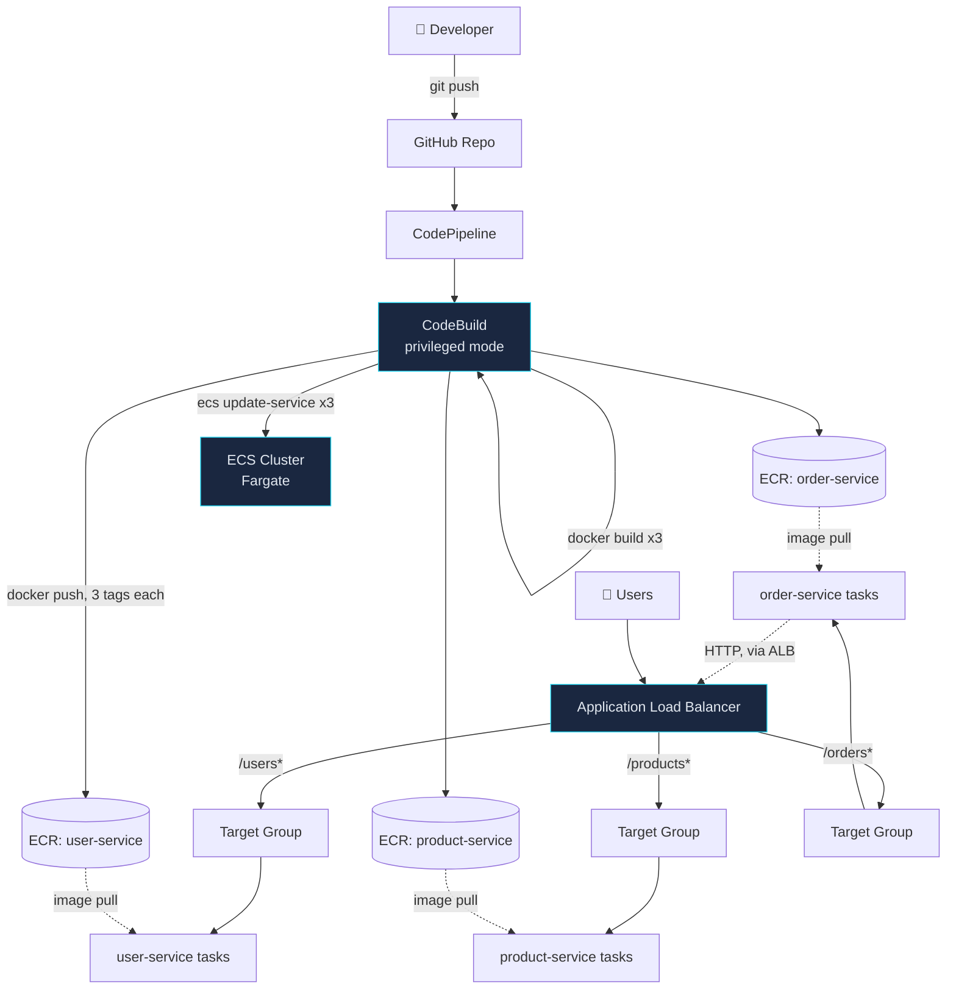

## PROJECT 3: "Box Everything" — Docker Containerization + AWS ECR + ECS Fargate

### 🧠 What Is This?

"It works on my machine" is the most famous — and most annoying — phrase
in software. Docker solves this forever by packaging your entire app —
code, libraries, settings — into a portable box called a container.

Imagine you're moving houses. Instead of disassembling every piece of
furniture and hoping it fits in the new house, you shrink everything into
a LEGO box. The box works identically whether you open it at home, at a
friend's house, or on the moon. **Docker** is the packing machine.
**AWS ECR** is the warehouse that stores your sealed boxes. **AWS ECS
Fargate** is the truck that delivers and runs your box — without you
ever having to rent, patch, or babysit the truck itself (no EC2
instances to manage, unlike Project 2).

By the end, you'll have 3 independent services, each in its own
container, talking to each other over a network, running on AWS with
zero servers for you to maintain.

### 🗺️ Architecture Diagram



**The order-service → ALB loop is deliberate**: order-service validates a
new order by calling user-service and product-service — and it reaches
them through the same public ALB path routes real users hit, not some
separate internal-only channel. Locally, docker-compose's built-in DNS
does the equivalent job without an ALB at all.

### 💰 AWS Cost Estimate

| Service | Free Tier | Beyond Free Tier |
|---|---|---|
| ECS Fargate (3 tasks, 0.25 vCPU/0.5GB each) | None for Fargate itself | ~$0.04/vCPU-hr + $0.004/GB-hr ≈ **$9-10/month** for 3 tasks running continuously |
| ECR | 500MB-month storage (12 months) | $0.10/GB-month beyond that |
| Application Load Balancer | None | ~$16/month + $0.008/LCU-hour (shared cost, same ALB pattern as Project 2) |
| CloudWatch Container Insights | None | ~$0.30 per monitored resource/month — modest at this scale |
| CodePipeline / CodeBuild | Same as Project 2 | ~100 build min/month free, then $0.005/min |

**Realistic total running continuously: ~$28–35/month**, dominated by the
ALB (fixed cost) plus 3 always-on Fargate tasks. Setting `desired_count`
lower or scaling to zero when not in active use (`aws ecs update-service
--desired-count 0`) cuts the Fargate portion to near zero — **the ALB
keeps billing regardless**, so `terraform destroy` is the only way to
stop that cost entirely.

### 🛠️ Tools & Why We Use Each One

| Tool | Problem It Solves | Alternative Without It |
|---|---|---|
| **Docker** | "Works on my machine" becomes impossible — the container IS the machine, everywhere | Dependency drift between dev/CI/prod causes mystery bugs |
| **Multi-stage builds** | Final image ships only runtime deps, not build tools | Bloated images — slower pulls, larger attack surface, more to patch |
| **ECR** | Private, IAM-authenticated image registry, integrated with ECS/scanning | Public Docker Hub for private code is a non-starter; self-hosting a registry is its own ops burden |
| **ECS Fargate** | Runs containers with zero EC2 instances to patch, size, or manage | Project 2's approach (EC2 + CodeDeploy) means YOU own OS patching, capacity planning |
| **ALB path-based routing** | One load balancer, one domain, routes `/users`, `/products`, `/orders` to 3 independent services | Either 3 separate load balancers (3x the fixed cost) or a hand-rolled reverse proxy |
| **Docker Compose** | Runs all 3 services + Redis + Postgres together locally with one command, real container-to-container networking | Manually starting 5 processes in 5 terminals, editing `/etc/hosts` to fake service discovery |
| **Auto Scaling (step scaling)** | Each service scales independently based on its own load | One service's traffic spike doesn't force the other two to over-provision |

### 📋 Prerequisites

- Everything from [Project 2](../project-2-robot-builder/) — including
  a completed, authorized GitHub connection (`github_connection_arn`
  output), which this project reuses
- [Docker Desktop](https://www.docker.com/products/docker-desktop/) installed and running —
  verify with `docker info`
- Python 3.10+ (for running the services outside Docker, if you want to)
- Basic familiarity with HTTP APIs (curl or Postman)

### 🚀 Step-by-Step Build

#### Step 1 — Understand the services

- `services/user-service` — 3 seeded users, optional Redis cache on `GET /users/{id}`
- `services/product-service` — 3 seeded products, plain in-memory reads
- `services/order-service` — creates orders by calling the other two
  services over HTTP to validate `user_id`/`product_id` exist and the
  product is in stock

Each has its own `Dockerfile`, `requirements.txt`, `.dockerignore` — they
know nothing about each other's internals, only each other's HTTP API.
That's the actual definition of a microservice boundary.

#### Step 2 — Run everything locally with Docker Compose

```bash
cd project-3-box-everything
docker compose up --build
```

Try it:
```bash
curl http://localhost:8001/users
curl http://localhost:8002/products
curl -X POST http://localhost:8003/orders \
  -H "Content-Type: application/json" \
  -d '{"user_id": 1, "product_id": 2, "quantity": 1}'
```
Watch `docker compose logs order-service` — you'll see it making real
HTTP calls to `http://user-service:8000` and `http://product-service:8000`,
resolved by Docker's built-in DNS. No IP addresses anywhere in the code.

#### Step 3 — Understand the Dockerfile (read one, they're all the same shape)

Open `services/user-service/Dockerfile`. Stage 1 (`builder`) installs
Python dependencies into `/root/.local`. Stage 2 starts fresh from a
clean `python:3.12-slim`, copies *only* those installed packages plus
your code, and runs as a non-root user. The `builder` stage — pip's
cache, the wheel-building toolchain — never makes it into the final
image. Check the size difference yourself:
```bash
docker build -t user-service:test services/user-service
docker images user-service:test
```

#### Step 4 — Deploy the infrastructure

```bash
cd terraform
terraform init

# Get the GitHub connection ARN Project 2 already authorized:
CONN_ARN=$(terraform -chdir=../../project-2-robot-builder/terraform output -raw github_connection_arn)

terraform apply -var="github_connection_arn=$CONN_ARN"
```
This creates 3 ECR repos, the ECS cluster + services (starting with the
*placeholder* image tag — see Step 5), the ALB with path routing, and the
CodePipeline/CodeBuild pair. No second manual OAuth step needed — you're
reusing Project 2's already-authorized connection.

#### Step 5 — First deploy: build and push real images

The ECS services exist after `terraform apply`, but they're pointed at
an image tag (`:latest`) that doesn't exist in ECR yet — the tasks will
sit in a failed/pending state until you push something. Either push
manually the first time:
```bash
cd ..
chmod +x scripts/deploy-ecs.sh
./scripts/deploy-ecs.sh
```
or just `git push` — CodePipeline picks it up automatically from here on.

#### Step 6 — Verify path-based routing

```bash
ALB_URL=$(terraform -chdir=terraform output -raw alb_dns_name)
curl "$ALB_URL/users"
curl "$ALB_URL/products"
curl -X POST "$ALB_URL/orders" -H "Content-Type: application/json" \
  -d '{"user_id": 1, "product_id": 1, "quantity": 2}'
```
The same domain, same port, three completely independent services behind
it — that's what the `aws_lb_listener_rule` path patterns in `alb.tf` are doing.

#### Step 7 — Demonstrate auto-scaling

Generate load against one service to trigger the CPU-high alarm (a crude
but effective way to prove the wiring works — real load testing would use
a proper tool like `hey` or `k6`):
```bash
for i in $(seq 1 5000); do curl -s "$ALB_URL/products" > /dev/null & done
```
Watch `aws ecs describe-services --cluster box-everything --services box-everything-product-service --query "services[0].desiredCount"`
climb as the `cpu-high` alarm fires, and settle back down a few minutes
after load stops as `cpu-low` fires.

#### Step 8 — Demonstrate: push code → new image → ECS rolling update

```bash
# Trivial, visible change
sed -i 's/Ada Lovelace/Ada Lovelace (v2)/' services/user-service/main.py
git add -A && git commit -m "test: rolling update demo" && git push
```
Watch CodePipeline run, then:
```bash
curl "$ALB_URL/users/1"
```
should show the updated name — with zero request failures during the
switch (ECS kept the old task serving until the new one passed its
health check).

### ✅ Verification Checklist

- [ ] `docker compose up --build` runs all 3 services + Redis + Postgres locally
- [ ] Creating an order via `order-service` actually validates against `user-service`/`product-service` (try an invalid `user_id` — expect a `400`, not a silent success)
- [ ] `docker images` shows each final image meaningfully smaller than an equivalent single-stage build
- [ ] All 3 ECR repos exist and contain `latest`, `v1.0.0`, and a commit-SHA tag after a deploy
- [ ] `$ALB_URL/users`, `/products`, `/orders` each return the correct service's data
- [ ] CloudWatch Container Insights shows per-task CPU/memory for all 3 services
- [ ] The load test in Step 7 visibly increases `desiredCount`, and it settles back down afterward
- [ ] A push to `master` results in a new image tag deployed with zero failed requests

### 🔥 Common Mistakes & How to Fix Them

1. **`docker build` works locally but CodeBuild fails with a permission/daemon error.**
   `privileged_mode = true` is required for CodeBuild to run its own inner
   Docker daemon — check `cicd.tf`. Without it, `docker build` fails
   immediately inside CodeBuild with a "Cannot connect to the Docker
   daemon" error.

2. **ECS tasks stuck in `PENDING` forever, never reach `RUNNING`.**
   Almost always an image pull failure — check the ECR repo actually has
   a `:latest` tag (Step 5). `aws ecs describe-tasks` with the task ARN
   shows the exact stopped reason.

3. **ALB returns 503 on `/orders` specifically, but `/users` and `/products` work.**
   `order-service` calls the other two through the ALB itself
   (`USER_SERVICE_URL`/`PRODUCT_SERVICE_URL` env vars in `ecs.tf`) — if
   those services aren't healthy yet, order-service's own calls fail even
   though order-service itself is running fine. Check target group
   health for all three, not just the one that's erroring.

4. **Local `docker compose up` works, but the same code fails on ECS with "connection refused" between services.**
   Compose's DNS (`http://user-service:8000`) doesn't exist outside
   Compose. This is exactly why the code reads these URLs from
   environment variables instead of hardcoding them — check the actual
   env vars ECS injected: `aws ecs describe-task-definition --task-definition box-everything-order-service`.

5. **Auto-scaling never triggers no matter how much load you throw at it.**
   `task_cpu = 256` (0.25 vCPU) is tiny — a handful of `curl` loops from
   one laptop may genuinely not be enough to cross 70% average CPU across
   the evaluation period. Use a real load-testing tool (`hey -z 60s -c 50 $ALB_URL/products`)
   for a convincing demo, not sequential `curl` calls.

### 🔗 How This Connects to the Next Project

ECS Fargate is fantastic for "I have a handful of independent services."
It starts to strain once you have dozens of services with complex
interdependencies, custom scheduling needs, or you want the exact same
deployment tooling across AWS, on-prem, and other clouds. Project 4
("Command the Fleet") moves this same 3-service application onto
**Kubernetes on EKS** — the industry-standard answer to "what runs
containers at real scale." The Docker images you just built don't change
at all; only how they're scheduled, networked, and observed does.
