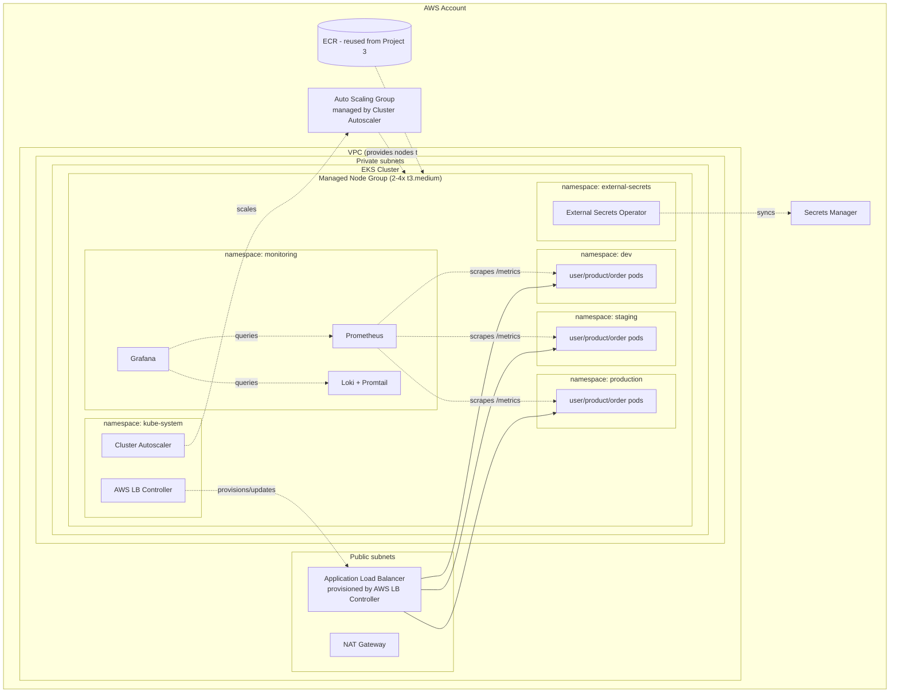

# Architecture — Command the Fleet

## Layers

## Why a custom VPC now, after 3 projects of using the default one

Projects 1-3 avoided NAT Gateway costs because nothing in them needed
network isolation strong enough to justify ~$32/month. EKS worker nodes
running in **private subnets** — no direct inbound path from the public
internet at all — is standard practice for any real cluster. The
tradeoff flips here: the security benefit of hiding worker nodes finally
outweighs the NAT cost, especially once the cluster is also running
things like the External Secrets Operator with access to Secrets Manager.

## The three trust boundaries

1. **Execution vs. runtime identity** (carried over from Project 3): IRSA
   roles for the AWS Load Balancer Controller, Cluster Autoscaler, and
   External Secrets Operator are each scoped to exactly one Kubernetes
   ServiceAccount in one namespace — none of them can assume each
   other's permissions, and neither can an application pod.
2. **Namespace-scoped RBAC**: the `developer` ClusterRole is bound in
   `dev` and `staging` via RoleBinding, but has no binding at all in
   `production`. Kubernetes RBAC denies by default — there is no explicit
   "deny production" rule anywhere; the absence of a grant IS the
   control.
3. **IAM → Kubernetes identity mapping**: EKS Access Entries (see
   `eks-cluster.tf`) map a real IAM role to the `developers` Kubernetes
   group. Whoever can assume that IAM role (via SSO, typically) shows up
   inside the cluster with exactly the permissions #2 grants — no
   separate Kubernetes-only credentials to manage.

## Request path: a user hitting `/orders`

1. DNS resolves to the ALB (provisioned by the AWS Load Balancer
   Controller reading the `Ingress` object in `helm/microservices/templates/ingress.yaml`)
2. ALB's path rule for `/orders*` forwards to the `order-service`
   Kubernetes `Service`
3. The `Service` load-balances across whichever `order-service` pods are
   `Ready` (passing their readiness probe)
4. `order-service`'s own code calls `http://user-service.<namespace>.svc.cluster.local:8000`
   and `http://product-service...` — resolved by Kubernetes' internal
   DNS (CoreDNS), never leaving the cluster network
5. Prometheus scrapes `/metrics` from all three pods every 15-30s
   (interval set by the ServiceMonitor kube-prometheus-stack creates);
   Grafana's RED dashboard queries Prometheus directly
