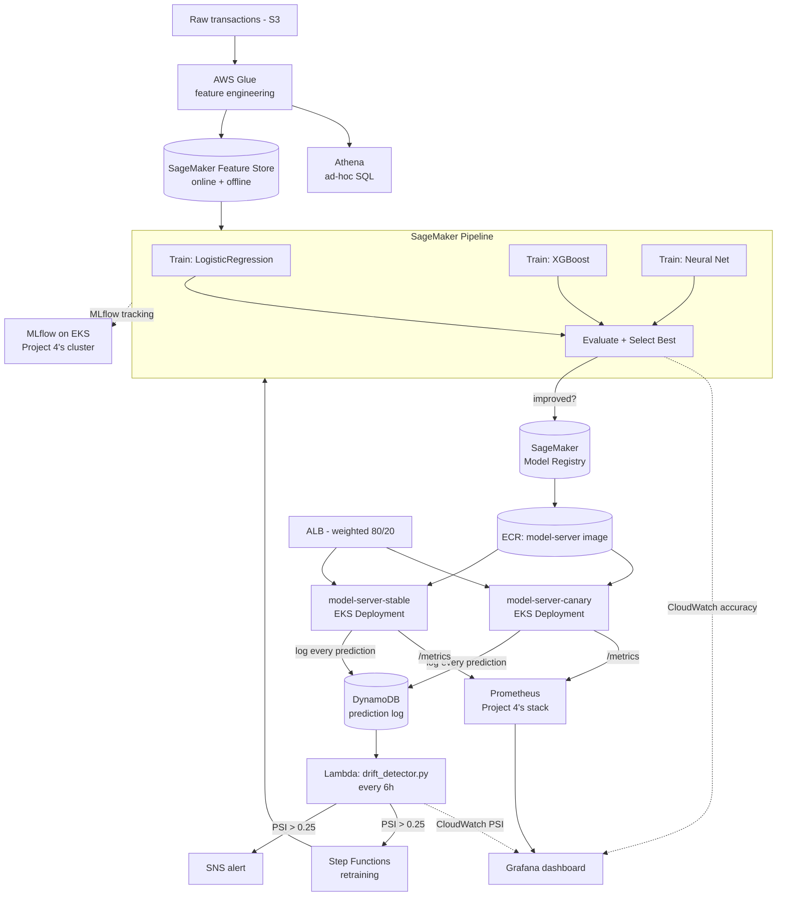

## PROJECT 5: "Teach the Machine" — End-to-End MLOps Pipeline on AWS

### 🧠 What Is This?

AI models don't just appear. Someone has to train them, test them,
deploy them, and keep them healthy. MLOps is DevOps for AI — it's how
companies ship AI products reliably instead of "a data scientist's
notebook that worked once."

Training a fraud-detection model is like training a dog: you collect
treats and training data (raw transactions), you teach it tricks
(training 3 candidate models), you test whether it actually learned
(evaluation against held-out data), and then it starts doing its job in
the real world (serving live predictions). But dogs get lazy over time —
so does a model, as the real world drifts away from what it was trained
on. MLOps is the entire training school, from puppy to professional
service dog, automated and repeatable: this project detects that drift
itself and retrains without a human kicking it off.

### 🗺️ Architecture Diagram



**The loop that makes this "MLOps" and not just "one training run"**:
drift detected → Step Functions starts the SageMaker Pipeline → 3 models
retrain → the best one is evaluated against the CURRENTLY deployed model
→ only registered if it's actually better → a human approves it in the
Registry → it becomes the canary → Grafana shows how it compares to
stable → promote or roll back. Every arrow in that sentence is real
infrastructure in this project, not a diagram aspiration.

### 💰 AWS Cost Estimate

| Service | Free Tier | Beyond Free Tier |
|---|---|---|
| SageMaker Training/Processing (ml.m5.large, ~3 concurrent jobs per run) | 250 hrs/month (2 months, ml.m5.large specifically) | ~$0.115/hr per job — a full pipeline run (~15 min x 5 jobs) costs well under $1 |
| SageMaker Feature Store (online store) | None | ~$0.75/GB-month + read/write throughput charges |
| Glue (2x G.1X workers, ~10 min/run) | 1M objects free in Data Catalog | ~$0.44/DPU-hour — a few cents per run |
| Lambda (drift check, every 6h) | 1M requests + 400,000 GB-seconds/month | Effectively free at this schedule frequency |
| Step Functions | 4,000 state transitions/month free | $0.025/1,000 transitions beyond that |
| DynamoDB (on-demand) | 25GB storage, 200M requests/month (always free) | Comfortably free at this project's prediction volume |
| Additional EKS pods (model-server, MLflow) | Uses Project 4's existing cluster/nodes | Marginal — may push you into needing 1 more node if the cluster was already near capacity |
| SNS, CloudWatch metrics | Same as prior projects | A few dollars/month at most |

**Realistic incremental cost on top of Project 4's ~$185–210/month baseline: ~$15–30/month**, mostly SageMaker job time and the extra
EKS node capacity for MLflow + 2 model-server variants. This project
reuses more existing infrastructure (Project 4's cluster, Project 2's
GitHub connection pattern) than any other in the series — that reuse is
itself a real cost optimization, not just a narrative device.

### 🛠️ Tools & Why We Use Each One

| Tool | Problem It Solves | Alternative Without It |
|---|---|---|
| **SageMaker Pipelines** | One versioned, retriable DAG from raw data to a registered model | A shell script chaining commands — no retry, no visualization, no parameter reuse |
| **MLflow** | Every training run's params/metrics/model are logged and comparable, automatically | "Which run produced this model?" answered by grepping filenames |
| **SageMaker Feature Store** | One feature definition serves both batch training and low-latency online lookups | Feature logic duplicated between a training script and a serving script, drifting apart |
| **SageMaker Model Registry** | Versioned models with an approval gate before anything serves traffic | "Just deploy whatever's in this S3 path" — no audit trail, no rollback target |
| **Glue + Athena** | Feature engineering that scales past what pandas can hold in memory, queryable via SQL | Rewriting the same transformation logic in Spark from scratch once data outgrows a laptop |
| **Step Functions** | Drift → retrain is a real, auditable, retriable workflow, not a cron job hoping for the best | A Lambda calling other Lambdas with no visibility into where a multi-step process failed |
| **DynamoDB + PSI drift detection** | Feature drift is measurable within hours, before ground-truth labels even exist | Waiting weeks for fraud chargebacks to reveal the model has quietly gotten worse |
| **Weighted ALB routing (A/B)** | A candidate model earns production traffic gradually, compared head-to-head in Grafana | All-or-nothing cutover — a bad model's blast radius is 100% of traffic from second one |

### 📋 Prerequisites

- Everything from [Project 4](../project-4-command-the-fleet/) — this
  project deploys onto that EKS cluster and reuses its Prometheus/Grafana stack
- Python 3.10+ with `pip install -r training/requirements.txt` (also covers evaluation/)
- Comfort with basic ML terminology (train/validation split, the
  metrics defined in `evaluation/evaluate.py`'s docstring if new)

### 🚀 Step-by-Step Build

#### Step 1 — Generate data and verify the local pipeline logic

Every script in `data/`, `features/`, `training/`, `evaluation/`, and
`serving/` has a pure-Python core that runs and was tested without any
AWS dependency — verify the whole loop locally before touching AWS:

```bash
cd project-5-teach-the-machine
python data/generate_synthetic_data.py --rows 50000 --out /tmp/transactions.csv
python -c "
import pandas as pd
from features.feature_engineering_glue_job import engineer_features
df = pd.read_csv('/tmp/transactions.csv')
engineer_features(df).to_parquet('/tmp/features.parquet', index=False)
"
cd training
python train.py --model-type logistic_regression --train-path /tmp/features.parquet --model-dir /tmp/model_lr --mlflow-tracking-uri file:./mlruns
python train.py --model-type xgboost --train-path /tmp/features.parquet --model-dir /tmp/model_xgb --mlflow-tracking-uri file:./mlruns
python train.py --model-type neural_net --train-path /tmp/features.parquet --model-dir /tmp/model_nn --mlflow-tracking-uri file:./mlruns
cd ../evaluation
python evaluate.py --mlflow-tracking-uri "file:../training/mlruns" --experiment-name fraud-detection
```
You should see 3 candidates and a `"selected"` model with the highest
ROC-AUC — this exact flow is what the SageMaker Pipeline automates.

#### Step 2 — Provision the infrastructure

```bash
cd ../terraform
terraform init
terraform apply -var="eks_cluster_name=command-the-fleet"
```
This reuses Project 4's cluster by name — make sure it's still running
(`kubectl get nodes`) before applying. Provisions: S3 buckets, Glue
job/database/crawler, SageMaker Feature Store + Model Registry group,
ECR repo, DynamoDB table, SNS topic, the drift-detection Lambda +
EventBridge schedule, the retraining Step Functions state machine, and
the MLflow tracking server on EKS.

#### Step 3 — Get the MLflow URL and register the pipeline

```bash
terraform output mlflow_ingress_hostname
```
Wait a few minutes for the ALB to provision if it prints "not yet
provisioned." Then:
```bash
cd ../pipelines
python sagemaker_pipeline.py --action upsert \
  --role-arn "$(terraform -chdir=../terraform output -raw sagemaker_execution_role_arn)" \
  --bucket "$(terraform -chdir=../terraform output -raw data_bucket)"
```
Edit the `hyperparameters` dict in `sagemaker_pipeline.py` to point
`mlflow-tracking-uri` at the real hostname from `terraform output`
before running this — it ships with a placeholder.

#### Step 4 — Upload data and run the pipeline

```bash
python ../data/generate_synthetic_data.py --rows 50000 --out transactions.csv
aws s3 cp transactions.csv "s3://$(terraform -chdir=../terraform output -raw data_bucket)/raw/transactions.csv"

python sagemaker_pipeline.py --action start \
  --role-arn "$(terraform -chdir=../terraform output -raw sagemaker_execution_role_arn)" \
  --bucket "$(terraform -chdir=../terraform output -raw data_bucket)"
```
Watch progress in the SageMaker Studio Pipelines UI, or:
```bash
aws sagemaker list-pipeline-executions --pipeline-name fraud-detection-pipeline
```

#### Step 5 — Compute the drift baseline and approve the first model

```bash
python ../monitoring/compute_baseline_stats.py --features-path <features output from Step 4> --out baseline_stats.json
aws s3 cp baseline_stats.json "s3://$(terraform -chdir=../terraform output -raw data_bucket)/monitoring/baseline_stats.json"

# In SageMaker Model Registry console: find the PendingManualApproval
# model package, review its metrics, click Approve. This is the one
# deliberate human checkpoint in an otherwise fully automated system.
```

#### Step 6 — Build and deploy the model server

```bash
cd ../serving
ECR_URL=$(terraform -chdir=../terraform output -raw ecr_model_server_repository_url)
aws ecr get-login-password | docker login --username AWS --password-stdin "$ECR_URL"
docker build -t "$ECR_URL:stable" -t "$ECR_URL:candidate" .
docker push "$ECR_URL:stable"
docker push "$ECR_URL:candidate"

cd ../helm/model-server
helm upgrade --install model-server . --namespace production \
  --set ecrRegistry="${ECR_URL%/*}" \
  --set stable.modelArtifactS3Uri="s3://<models-bucket>/<approved-model-path>/model.tar.gz" \
  --set canary.modelArtifactS3Uri="s3://<models-bucket>/<approved-model-path>/model.tar.gz" \
  --set serviceAccountRoleArn="$(terraform -chdir=../terraform output -raw model_server_irsa_role_arn)"
```
(Both variants point at the same model initially — that's the honest
starting state. A real A/B test begins in Step 8, once a second
candidate exists.)

#### Step 7 — Confirm predictions flow end-to-end

```bash
MODEL_ALB=$(kubectl get ingress model-server -n production -o jsonpath='{.status.loadBalancer.ingress[0].hostname}')
curl -X POST "http://$MODEL_ALB/predict" -H "Content-Type: application/json" -d '{
  "amount_log": 6.2, "hour_sin": -0.9, "hour_cos": 0.4, "is_night": 1,
  "txn_count_last_hour": 5, "high_velocity": 1, "distance_from_home_km": 450,
  "far_from_home": 1, "card_age_days": 12, "new_card": 1
}'
```
Check the prediction landed in DynamoDB: `aws dynamodb scan --table-name <prediction_log table> --max-items 1`

#### Step 8 — A/B test a new candidate

After a retrain produces a new approved model:
```bash
helm upgrade model-server ../helm/model-server --namespace production \
  --reuse-values \
  --set canary.modelArtifactS3Uri="s3://<models-bucket>/<new-model-path>/model.tar.gz"
```
Open Grafana (`kubectl port-forward -n monitoring svc/prometheus-grafana 3000:80`
— same Grafana Project 4 set up), import `monitoring/grafana-dashboard.json`,
and watch the stable-vs-canary latency and request-rate panels. Promote
by setting `stable.modelArtifactS3Uri` to match the canary's and
`stable.weight: 100` / `canary.weight: 0`.

#### Step 9 — Demonstrate automated drift-triggered retraining

Manually invoke the drift detector to see the full loop without waiting
for the schedule:
```bash
aws lambda invoke --function-name "$(terraform -chdir=terraform output -raw ... )" /tmp/out.json && cat /tmp/out.json
```
With fewer than 30 logged predictions, it reports `"skipped"` — generate
more traffic first (loop Step 7's curl command). With enough data and a
PSI above threshold (try feeding predictions with deliberately unusual
`distance_from_home_km` values to manufacture drift), watch the SNS
email arrive and a new execution appear in Step Functions.

### ✅ Verification Checklist

- [ ] Local end-to-end run (Step 1) produces 3 MLflow runs and a correct `"selected"` model
- [ ] SageMaker Pipeline execution completes with all 6 steps `Succeeded`
- [ ] A model package appears in the Model Registry with `PendingManualApproval` status
- [ ] MLflow UI (at the ALB hostname) shows all 3 runs with logged params/metrics
- [ ] `/predict` against the model-server ALB returns a `fraud_probability`
- [ ] DynamoDB shows new prediction rows after generating traffic
- [ ] Grafana's stable-vs-canary panels show the configured 80/20 request split
- [ ] Manually invoking the drift Lambda with >30 logged predictions returns a real PSI score, not `"skipped"`
- [ ] Forcing a high-PSI scenario triggers both the SNS email and a new Step Functions execution

### 🔥 Common Mistakes & How to Fix Them

1. **SageMaker Training Jobs can't reach the MLflow tracking URI.**
   MLflow's ALB is public specifically so AWS-managed training
   infrastructure (outside your VPC) can reach it — but the URL in
   `sagemaker_pipeline.py`'s hyperparameters is a placeholder. Update it
   to the real `terraform output mlflow_ingress_hostname` before
   upserting the pipeline.

2. **`evaluate.py`'s `get_current_registered_metric` always returns 0.0, so everything "improves."**
   Expected and correct for the FIRST model ever registered (cold start
   — nothing to beat yet). If it's still happening after a model has
   been Approved, check `ModelApprovalStatus="Approved"` actually got
   set in the console — a `PendingManualApproval` model doesn't count as
   "current" on purpose, so an unapproved bad model can't silently raise
   the bar.

3. **The drift Lambda fails with `ModuleNotFoundError: No module named 'numpy'`.**
   Called out directly in `terraform/lambda.tf`'s comments: the standard
   Lambda runtime doesn't include numpy. Attach AWS's published
   AWSSDKPandas Lambda Layer (ARN commented out in that file) or build a
   custom layer.

4. **Weighted A/B routing sends 100% of traffic to one variant regardless of configured weights.**
   Check `kubectl describe ingress model-server -n production` for the
   AWS Load Balancer Controller's actual applied rule — a common cause
   is both `stable` and `canary` Services reporting 0 healthy targets
   for one variant (check `initContainer` logs: `kubectl logs <pod> -c fetch-model`
   — usually an S3 permissions or wrong-URI issue).

5. **Step Functions execution fails immediately with an access-denied-flavored error that doesn't mention IAM.**
   The `.sync` SageMaker integration needs `events:PutTargets`/`PutRule`/`DescribeRule`
   permissions to set up its internal completion-polling mechanism — see
   the comment in `terraform/step_functions.tf`. Missing these produces
   a confusing error that doesn't obviously point at IAM.

### 🔗 Where This Leaves You

Five projects, one thread: Project 1 taught you how anything reaches the
internet at all. Projects 2-3 taught you how code ships itself, first to
servers you manage, then to servers you don't. Project 4 taught you how
to run many services at real scale with real observability. Project 5
took every one of those muscles — CI/CD, containers, Kubernetes,
IAM-scoped automation, Terraform-as-the-source-of-truth — and pointed
them at a machine learning system instead of a REST API. That's the
actual claim MLOps makes: it isn't a different discipline from DevOps,
it's DevOps applied to a workload that happens to retrain itself.
